# MP0616-PROJ2-ENRT1
# Prototipo del videojuego 
*Dariush Lotfi y Rohit Jaswal*
*2n Daw*

---
## Estilos del videojuego

### Tipografia

**Logo**
* Hemos utilizado una web que permite generar textos con la tipografia del juego "StreetFighter" -  https://www.textstudio.com/logo/street-fighter-logo-972#google_vignette

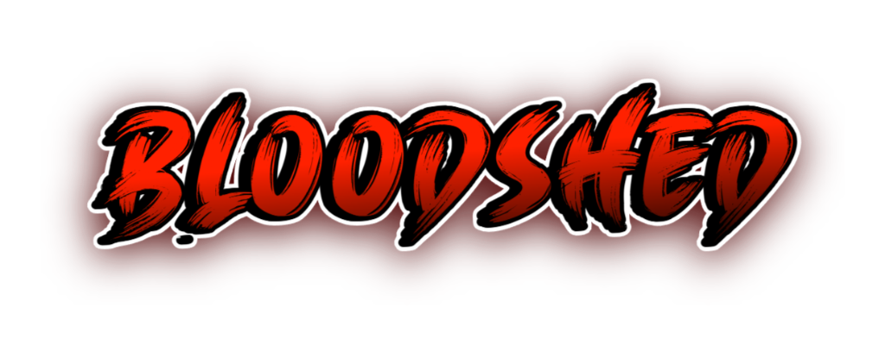

**Fuente principal**
* Press start 2P - https://fonts.google.com/specimen/Press+Start+2P

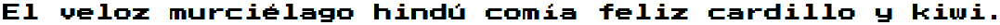

**Fuente secundaria**
* Minecraftia - https://www.dafont.com/es/minecraftia.font 

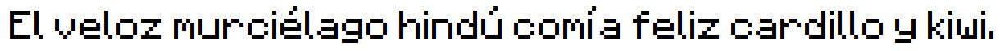

### Paleta de colores
**Colores principales**
Colores del menú y del background
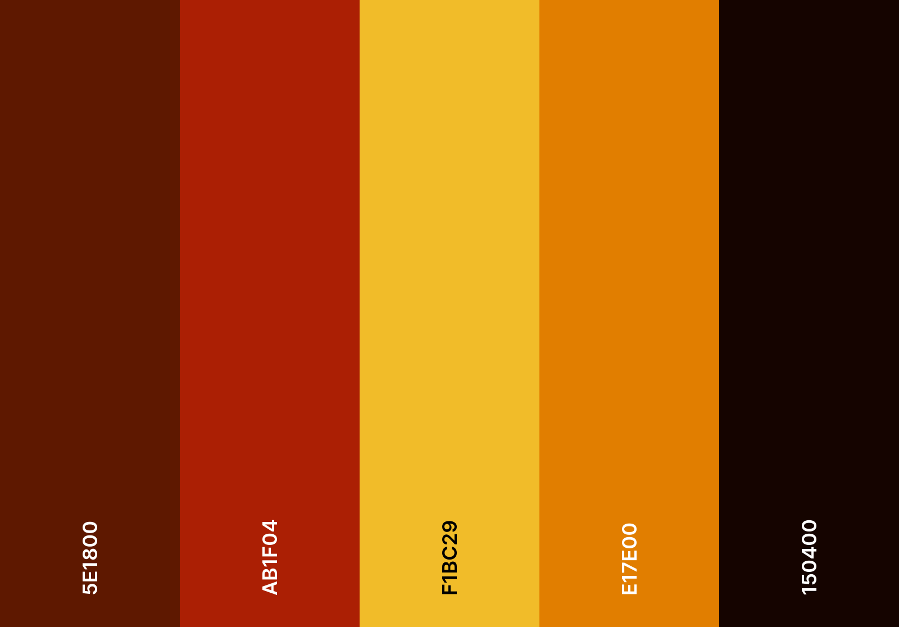

---
## Wireframe

**Menú Principal**
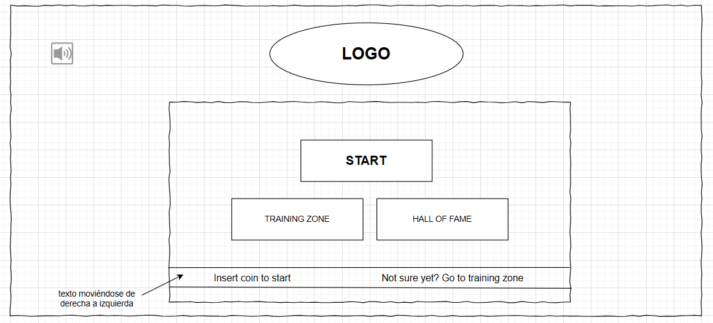

**Combate**
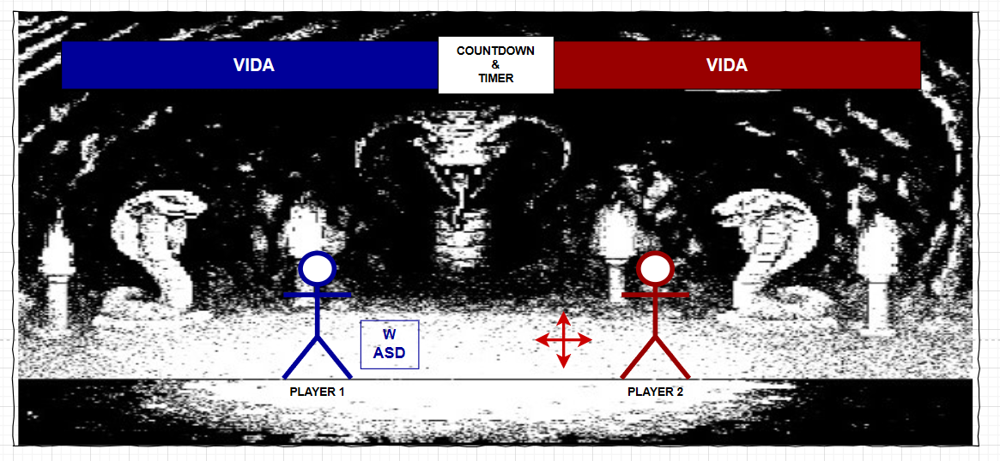

**Zona de entrenamiento**
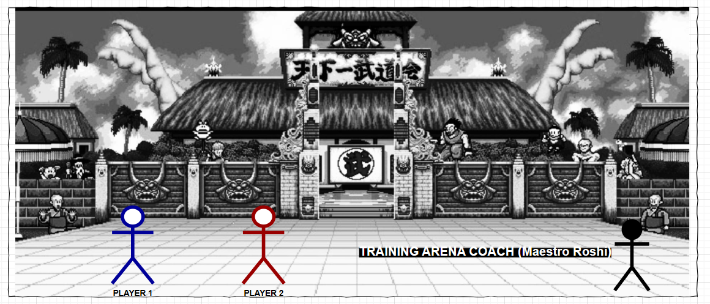

**Salón de la fama**
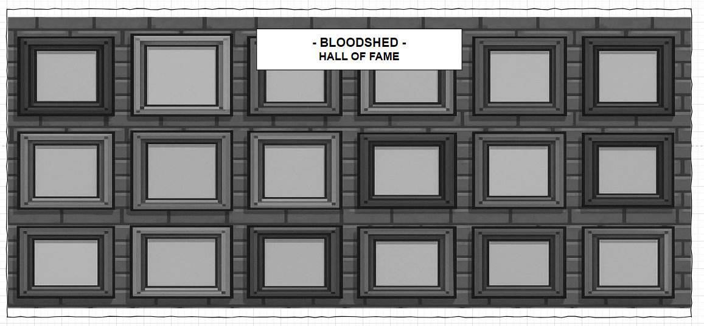

---
## Recursos gráficos del juego

**Sprites**
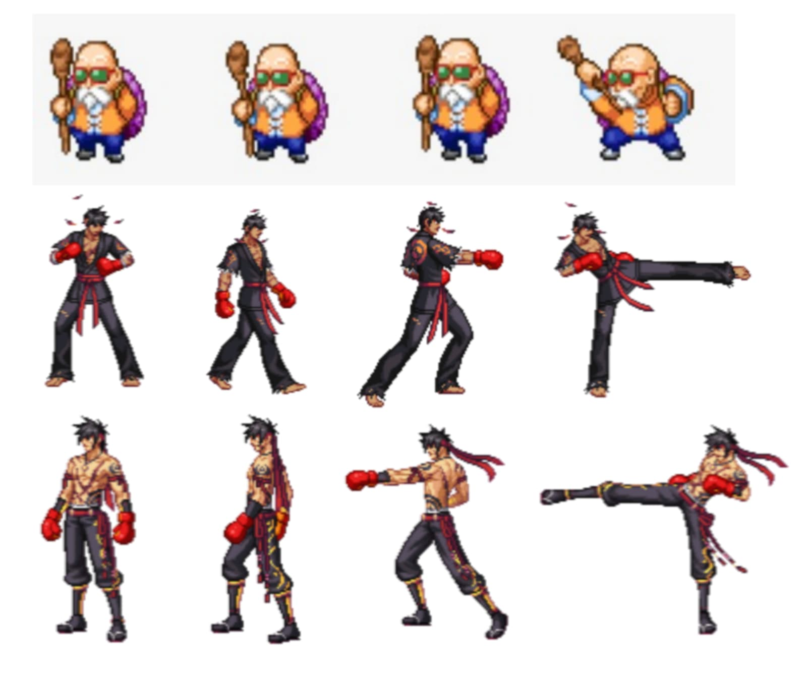

**Fondo Menú Principal**
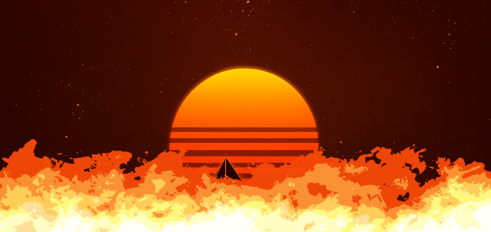

**Fondo Arena Combate 1**
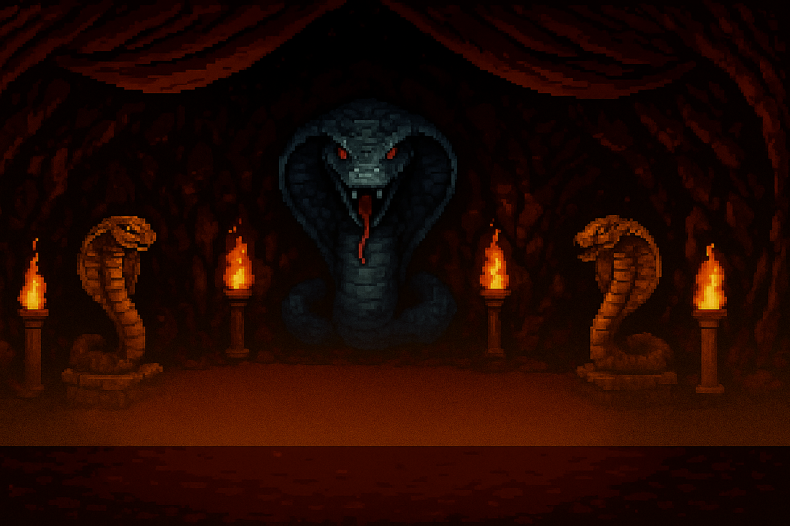

**Fondo Arena Combate 2**
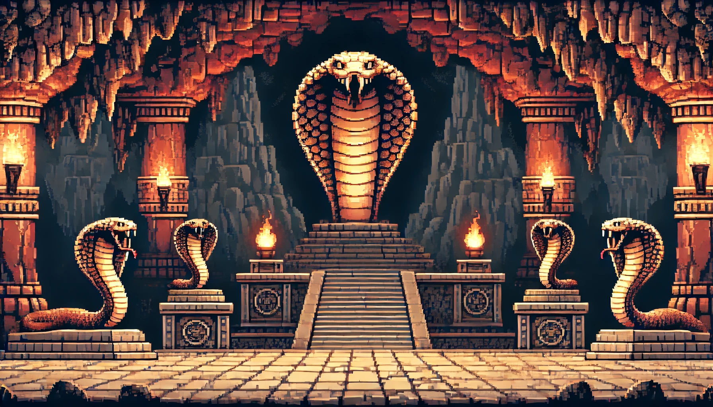

**Fondo Zona de entrenamiento**
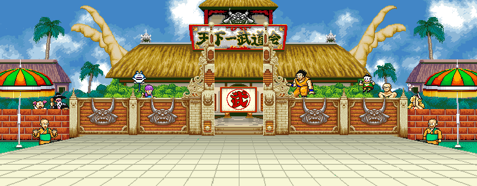

**Fondo Salón de la fama**
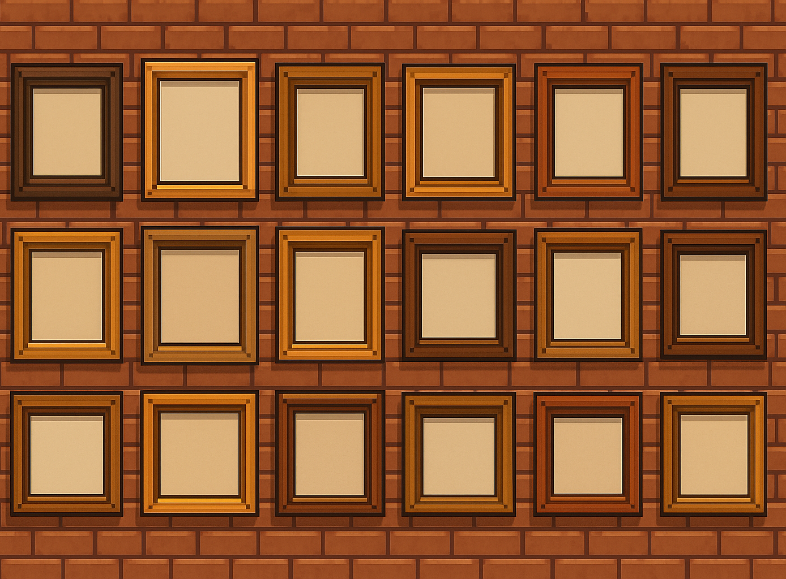

---
## Diagrama de Flujo

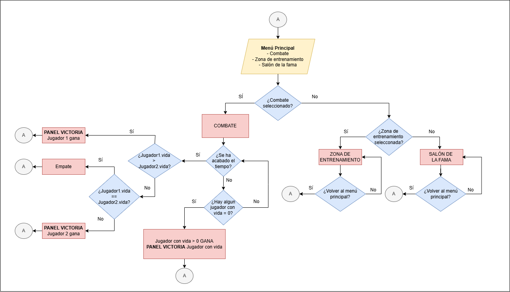
